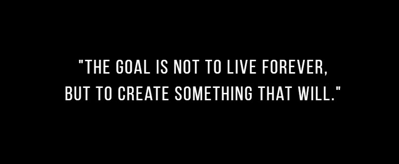

## Hii, I'm Rahul 👋:
- I am a final year CS student with a great passion for programming. :sparkling_heart:
- Just like anyone, I have big dreams. And I see coding as a way to make them all come true. :rocket:
- I am interested in Web Development, Machine Learning and Data Science. :computer:
- I haven't perfected these technologies yet but I'm constantly learning and working hard to improve my skills. :seedling:
- Currently I'm learning Full Stack development and doing some projects on it; you can find them here in my profile. :arrow_down:
- I’m looking forward to collaborate on exciting freelance projects and new Ideas. :handshake:
- If my works and ideas interest you, you can reach me through my Email: projektArkane@gmail.com :e-mail:

### Programming Languages

 
  
 
 
 
 
 

***

 ##### *"Dreams don't work, until you do."* 

<!---
projektArkane/projektArkane is a ✨ special ✨ repository because its `README.md` (this file) appears on your GitHub profile.
You can click the Preview link to take a look at your changes.
--->
